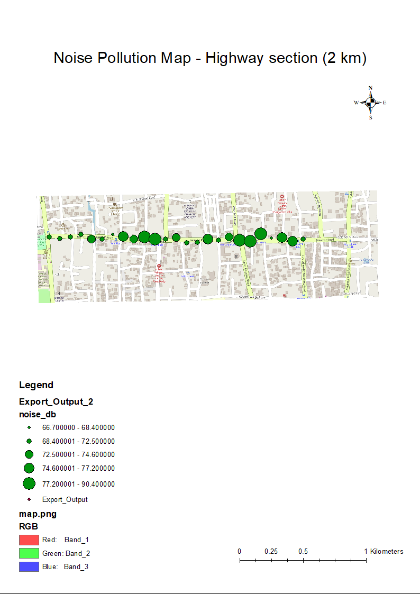

# 🛰️ Noise Pollution Mapping Near a Highway using ArcGIS

> **KTU S7 Mini Project — CET465: Geo-Informatics**

This project analyzes and visualizes **noise pollution** along a **2 km highway stretch** using **ArcMap** (ArcGIS Desktop).  
It demonstrates how **spatial interpolation techniques** like *Inverse Distance Weighted (IDW)* and *Kriging* can be applied to environmental noise data to identify **hotspots** and support **urban noise management**.

---

## 📘 Project Overview

| Category | Details |
|-----------|----------|
| **Course** | CET465 – Geo-Informatics |
| **Institution** | MA College of Engineering |
| **Guide** | Prof. Balu Elias George |
| **Team Members** | Shamir Ashraf, Sajin, Nizam |
| **Software** | ArcMap (ArcGIS Desktop) |
| **Data Source** | Simulated noise data (25 points, 65–90 dB) |
| **Study Area** | 2 km highway stretch near 10.000°N, 76.25°E (Kerala region) |
| **CRS Used** | WGS84 (EPSG:4326), UTM Zone 43N (EPSG:32643) |

---

## 🎯 Aim

To prepare a **Noise Pollution Map** for a 2 km stretch of highway using ArcMap and to analyze the spatial variation of noise levels through interpolation techniques.

---

## 🧭 Objectives

1. Collect or simulate noise level data points along a highway section.  
2. Import and visualize the data in ArcMap.  
3. Generate interpolated noise surfaces using **IDW** and **Kriging** methods.  
4. Prepare a **thematic map** showing noise intensity with graduated symbols.  
5. Interpret spatial patterns and identify noise hotspots.  

---

## ⚙️ Methodology

### 1. Data Preparation
- CSV file containing 25 noise measurement points (latitude, longitude, noise dB).
- Added to ArcMap via **Add XY Data** and exported as shapefile.

### 2. Projection
- Reprojected to **UTM Zone 43N** for accurate distance-based interpolation.

### 3. Interpolation
- **IDW:** Inverse Distance Weighted method, power = 2, cell size = 10 m.  
- **Kriging:** Spherical model, automatic variogram, cell size = 10 m.

### 4. Visualization
- IDW and Kriging rasters examined for spatial trend analysis.
- Final thematic map created using **graduated point symbols** sized by `noise_db` values.

### 5. Layout and Export
- Added legend, scale bar, north arrow, and basemap (OpenStreetMap).
- Exported final layout as **PDF and PNG (300 dpi)**.

---

## 🗺️ Results

### IDW Interpolation Surface


### Kriging Interpolation Surface


### Final Thematic Map (Graduated Symbols)


---

## 📊 Interpretation

- Two major **high-noise zones** were observed near **junctions A and B** (approx. 800 m and 1600 m).  
- Maximum recorded noise: ~89 dB.  
- Average noise across the stretch: ~74 dB.  
- Noise decreases with distance from the road — typical of traffic-related noise propagation.  

---

## 💡 Recommendations

- Install **noise barriers** or **vegetation strips** near junctions.  
- Implement **traffic flow control** and **restricted honking** zones.  
- Conduct **periodic noise monitoring** during different time intervals (day/night).  
- Extend study to multiple highway sections using actual field data.

---

## 🧩 Folder Structure

```

├── data/
│   └── noise_points.csv        # Simulated noise measurement data
├── images/
│   ├── idw.png                 # IDW interpolation output
│   ├── kriging.png             # Kriging interpolation output
│   └── mini.png                # Final thematic map (graduated symbols)
├── report/
│   └── Mini_Project_Report.pdf # Full formatted report
├── README.md                   # This file
└── project.mxd                 # ArcMap project file

```

---

## 🧠 Theory Background

### Noise Pollution
- Noise is unwanted sound measured in **decibels (dB)**.  
- Road traffic noise is one of the major environmental pollutants in cities.  
- Prolonged exposure above **85 dB** may cause hearing damage.

### Interpolation Methods
- **IDW (Inverse Distance Weighted):** Simple deterministic method; closer points have higher influence.  
- **Kriging:** Geostatistical method that models spatial autocorrelation using a variogram; more accurate but complex.

---

## 🧰 Tools and Libraries

- **ArcMap (ArcGIS Desktop)** – Spatial analysis and mapping  
- **Spatial Analyst Extension** – IDW and Kriging interpolation  
- **OpenStreetMap Basemap** – Free base layer for spatial context  
- **Microsoft Excel / CSV** – Data preparation  

---

## 🧾 License

This project is released under the **MIT License** — you’re free to use, modify, and share with attribution.

---

## 🧑‍🏫 Acknowledgment

We sincerely thank **Prof. Balu Elias George** for his valuable guidance, technical advice, and continuous support during the completion of this mini project.
